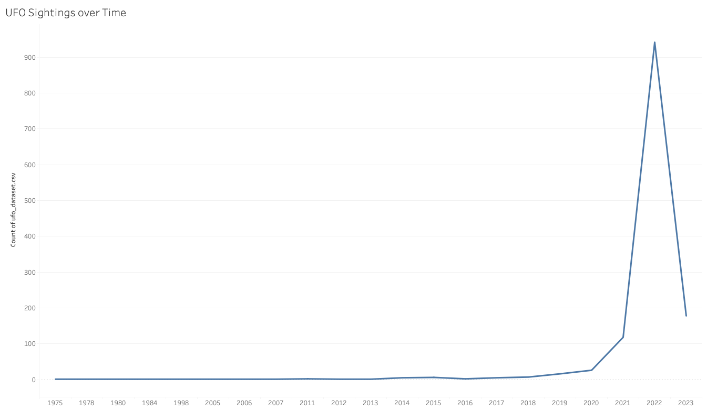
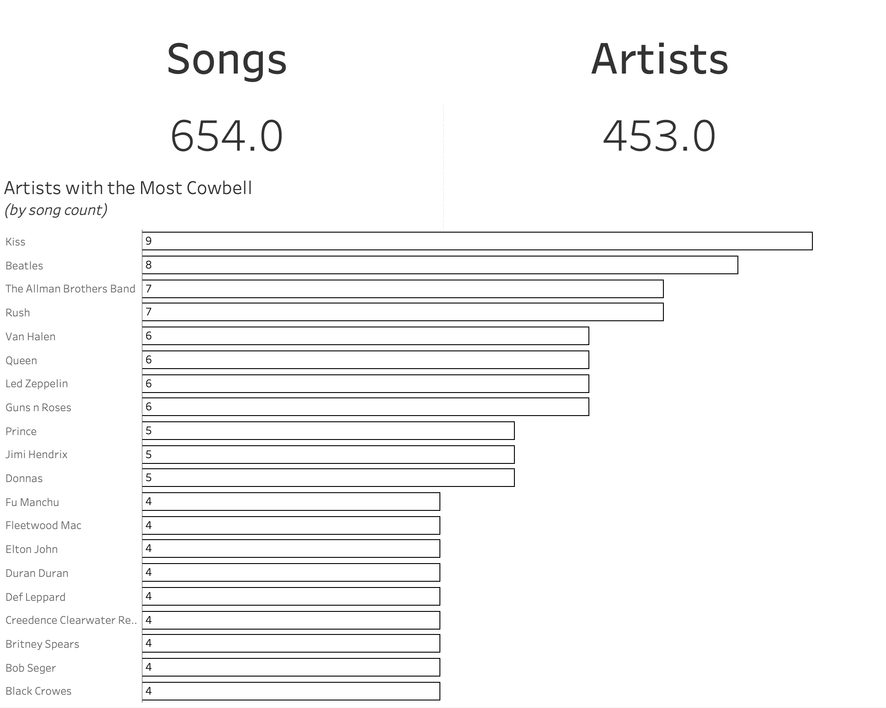
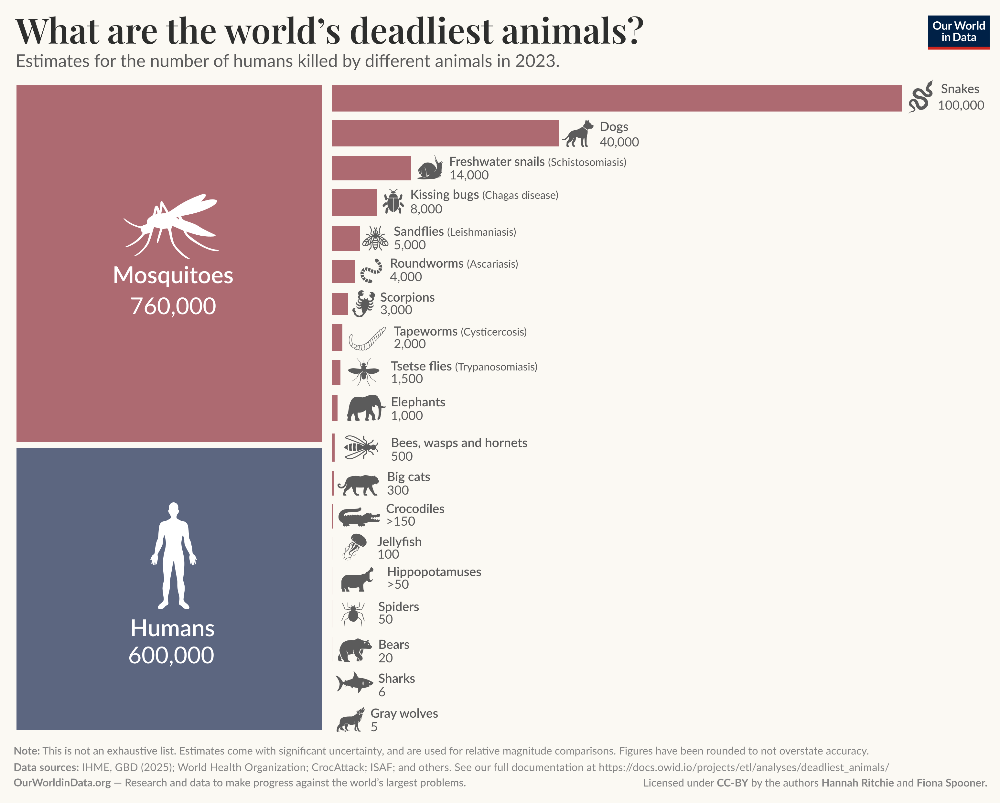

# Relatório: Redesign Crítico de Visualizações de Dados

**Integrantes:** _(preencher)_

## 1. Introdução

O objetivo é criticar visualizações publicadas e propor dois redesigns para cada uma, feitos com D3.js e DuckDB.

Os casos vêm do Makeover Monday e foram escolhidos por terem o gráfico e os dados disponíveis e por terem problemas diferentes: escala de tempo, ranking e qualidade dos dados, e mistura de codificações.

1. **UFO Sightings over Time** (2026 W25): avistamentos de OVNI por ano.
2. **Songs with Cowbell** (2026 W40): artistas com mais músicas que usam cowbell.
3. **What are the world’s deadliest animals?** (2026 W37): animais que mais matam pessoas por ano.

## 2. Análise dos casos

### 2.1 UFO Sightings over Time

**Fonte:** [Makeover Monday 2026 W25](https://makeovermonday.vercel.app/dataset/2026-wk25-ufo-sightings), dados do NUFORC no [Kaggle](https://www.kaggle.com/datasets/joebeachcapital/ufo-sightings).
**Pergunta:** os avistamentos de OVNI estão aumentando com o tempo?

**Dados:** 1317 relatos com data e hora do avistamento, data de publicação, cidade, estado, formato, duração, descrição e coordenadas. O original usa só a data (contagem por ano).

**Tarefa:** ver a tendência ao longo do tempo.

**Crítica:**

- O eixo X é categórico: de 1984 para 1998 (14 anos) tem a mesma distância que de 2021 para 2022.
- A linha liga anos que não existem no arquivo, sugerindo uma série contínua.
- Os relatos foram publicados só entre dez/2021 e mar/2023. O "crescimento" até 2022 e a queda em 2023 são efeito do período de coleta, não dos avistamentos.
- O eixo Y se chama "Count of ufo_dataset.csv" e não há fonte nem período informado.

**Design A: avistamentos por mês.**

Barras mensais só de jan/2022 a fev/2023, o período com coleta completa (1094 relatos; os 223 de fora são informados no gráfico). Barras em vez de linha porque cada mês é uma contagem separada, e a linha do original sugeria continuidade. Meses sem relato aparecem com zero e o valor fica escrito em cima de cada barra. O pico é em setembro de 2022 (115) e o mínimo em dezembro de 2022 (49).

**Design B: heatmap dia da semana x hora.**

Cada célula mostra quantos relatos aconteceram naquele dia e hora. A cor usa 5 faixas fixas (0 a 1, 2 a 4, 5 a 9, 10 a 19, 20 ou mais), porque a maioria das células tem poucos relatos e faixas iguais deixariam quase tudo da mesma cor. Mostra que 59% dos relatos acontecem entre 17h e 23h, com pico no sábado às 19h.

**Comparação:**

| | Design A | Design B |
|---|---|---|
| Tarefa | tendência real no tempo | padrão de dia e hora |
| Melhoria | corrige o período e o falso crescimento | mostra um padrão escondido pela soma anual |
| Trade-off | perde os anos antigos | não mostra tendência |
| Uso | responder a pergunta do original | análise exploratória |

O A responde a pergunta do original de forma correta e o B mostra que existe um padrão forte no tempo, só que no dia e não no ano.

### 2.2 Songs with Cowbell

**Fonte:** [Makeover Monday 2026 W40](https://makeovermonday.vercel.app/dataset/songs-with-cowbell), dados de [cowbellsongs.com](https://cowbellsongs.com/the-list/).
**Pergunta:** quais artistas mais usam cowbell nas músicas?

**Dados:** 661 linhas com artista e título da música (convertido de xlsx para CSV). A quantidade de músicas por artista é derivada.

**Tarefa:** ver e comparar os artistas do topo.

**Crítica:**

- O ranking corta em 20 no meio de um empate: 16 artistas têm 4 músicas e só 9 aparecem. Os 7 cortados são os últimos em ordem alfabética.
- Os totais (654 músicas, 453 artistas) não batem com o arquivo, que tem 2 músicas repetidas e 5 artistas com grafias diferentes (ex: "B-52s" e "B’52s"). Limpo, são 659 músicas de 449 artistas.
- Contagens com casa decimal ("654.0"), barras sem preenchimento e texto muito pequeno.
- Mostra só o topo, sem contexto do resto da lista.

**Design A: um quadrado por música.**

Todos os 27 artistas com 4 ou mais músicas, sem cortar empates, com cada música como um quadrado (o nome aparece no tooltip). Nomes duplicados corrigidos no DuckDB.

**Design B: histograma de músicas por artista.**

Quantos artistas têm 1, 2, 3... músicas, com destaque em laranja na faixa que o original mostra. Mostra que 76% dos artistas (340 de 449) têm só uma música.

**Comparação:**

| | Design A | Design B |
|---|---|---|
| Tarefa | ranking completo | distribuição da lista |
| Melhoria | sem corte arbitrário e com dados limpos | mostra o contexto que o original esconde |
| Trade-off | mostra só 27 de 449 artistas | não mostra nomes |
| Uso | saber quem usa mais cowbell | entender a lista como um todo |

O A mostra quem está no topo e o B mostra que esse topo é uma parte pequena da lista.

### 2.3 What are the world’s deadliest animals?

**Fonte:** [Makeover Monday 2026 W37](https://makeovermonday.vercel.app/dataset/what-are-the-world-s-deadliest-animals), gráfico do Our World in Data (dados do IHME, OMS e outros).
**Pergunta:** quais animais mais matam pessoas por ano?

**Dados:** 21 animais com nome, tipo (inseto, mamífero, réptil...), número de mortes por ano e um marcador ">" quando o valor é só um mínimo (crocodilos e hipopótamos).

**Tarefa:** comparar os animais e ver quais são os mais perigosos.

**Crítica:**

- Duas codificações no mesmo gráfico: mosquitos e humanos são a área de um quadrado e os outros são o comprimento de uma barra. A barra das cobras (100 mil) fica mais larga que o quadrado dos mosquitos (760 mil), então os dois grupos não podem ser comparados.
- Escala linear: das 19 barras, 9 representam menos de 1% da maior (cobras) e ficam quase invisíveis.
- Os valores com ">" (mínimos) são desenhados igual aos outros.
- O tipo de animal está nos dados mas não aparece no gráfico.

**Design A: todos os animais na mesma escala.**

Barras horizontais para os 21 animais, incluindo mosquitos e humanos, com escala logarítmica para os valores pequenos também aparecerem. Humanos em cinza, por não serem o foco da pergunta, e estimativas mínimas com a cor mais apagada e o sinal ">" no valor.

**Design B: waffle por tipo de animal.**

Grade de 10x10 em que cada quadrado vale 1% das mortes, colorida pelo tipo de animal (humanos separados e os tipos muito pequenos juntos em "Outros"), com a legenda mostrando a porcentagem e o total de cada tipo. Usa o tipo do animal, que o original ignora, e uma unidade só (o quadrado) para todos. Mostra que os insetos são metade das mortes (50,3%), quase todas de mosquitos, e os humanos 39%.

**Comparação:**

| | Design A | Design B |
|---|---|---|
| Tarefa | comparar animais um a um | comparar grupos de animais |
| Melhoria | uma codificação só e todos visíveis | proporção fácil de ler e usa o tipo do animal |
| Trade-off | escala log é mais difícil de ler e esconde o tamanho real das diferenças | arredonda para 1% e junta os tipos pequenos em "Outros" |
| Uso | ver a posição de cada animal | entender de onde vêm as mortes |

Os dois se complementam: o A mostra todos os animais e o B mostra o quanto os mosquitos dominam.

## 3. Implementação

- **DuckDB** (`db.js`, `casos/`): carrega os CSVs no navegador e faz todas as transformações em SQL: conversão de datas (`try_strptime`), contagem por mês (`date_trunc`, `range`), por dia e hora (`dayofweek`, `hour`), normalização de nomes (`regexp_replace`, `min() OVER`), remoção de repetidas (`DISTINCT`), tradução dos tipos de animal (`CASE`) e soma e porcentagem das mortes por tipo (`GROUP BY`, `sum`).
- **D3.js** (`redesigns/`): um arquivo por redesign, usando `scaleBand`, `scaleLinear`, `scaleLog`, `scaleThreshold` e uma grade de quadrados (waffle), com tooltip.

## 4. Discussão final

Nos casos UFO e Cowbell o problema principal estava nos dados: o UFO esconde o período de coleta e o Cowbell esconde dados repetidos e um corte arbitrário. No caso dos animais o problema é visual: duas codificações misturadas e uma escala que esconde quase metade dos valores. Por isso as decisões mais importantes foram recortar o período e limpar os nomes, e depois usar uma codificação só e a escala certa para a tarefa (log para comparar todos, waffle para ver proporções).

**Limitações:** o período confiável do UFO é curto (14 meses) e o heatmap depende da hora informada no relato. No Cowbell a normalização pode não pegar todas as variações de nome, e a lista do site não é completa. No caso dos animais a escala log exige mais atenção do leitor, e os valores são estimativas arredondadas.

**Aprendizados:** é preciso entender como os dados foram coletados antes de escolher o gráfico; a mesma pergunta pode ser respondida em escalas diferentes (mês ou hora); e o mapeamento visual tem que combinar com o dado (contagem sem decimal, ranking sem cortar empates, uma codificação só para comparar valores).
